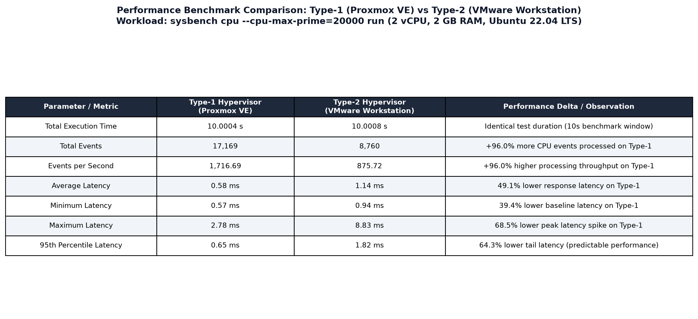

# Performance Analysis of Type-1 vs Type-2 Hypervisors

## Experiment Overview

This repository documents an empirical performance benchmark and comparative architectural evaluation between a **Type-1 Bare-Metal Hypervisor (Proxmox VE)** and a **Type-2 Hosted Hypervisor (VMware Workstation)**.

Virtual machines configured with identical compute resources (**2 vCPU**, **2 GB RAM**, **20 GB Disk**, **Ubuntu 22.04 LTS**) were tested using the `sysbench` CPU benchmark (`sysbench cpu --cpu-max-prime=20000 run`).

---

## Repository Structure

```text
.
├── .gitignore
├── README.md
│
├── screenshots/
│   ├── type1-proxmox/
│   │   ├── 01-proxmox-dashboard.png
│   │   ├── 02-proxmox-vm-configuration.png
│   │   ├── 03-proxmox-vm-running.png
│   │   ├── 04-proxmox-ubuntu-console.png
│   │   ├── 05-proxmox-system-configuration.png
│   │   ├── 06-proxmox-sysbench-result.png
│   │   └── 07-proxmox-resource-monitoring.png
│   │
│   ├── type2-vmware/
│   │   ├── 01-vmware-vm-configuration.png
│   │   ├── 02-vmware-vm-running.png
│   │   ├── 03-vmware-system-configuration.png
│   │   └── 04-vmware-sysbench-result.png
│   │
│   └── comparison/
│       └── 01-hypervisor-performance-comparison.png
│
├── results/
│   ├── performance-analysis.md
│   └── benchmark_results.csv
│
└── graphs/
    └── performance_comparison.png
```

---

## Standard Virtual Machine Configuration

To ensure rigorous benchmarking fairness, both virtual machines use identical resource allocations:

| Resource | Configuration Specification |
| :--- | :--- |
| **Guest Operating System** | Ubuntu 22.04 LTS (64-bit) |
| **Virtual CPUs (vCPU)** | 2 vCPUs (1 Socket, 2 Cores/Socket) |
| **Memory (RAM)** | 2 GB (2048 MiB) |
| **Storage (Disk)** | 20 GB Virtual Disk |
| **Benchmark Tool** | Sysbench (CPU workload) |
| **Benchmark Command** | `sysbench cpu --cpu-max-prime=20000 run` |

---

## Type-1 Hypervisor – Proxmox VE

### Mandatory Evidence Table

| Screenshot | Evidence |
|---|---|
| `01-proxmox-dashboard.png` | Proxmox VE dashboard |
| `02-proxmox-vm-configuration.png` | VM configuration |
| `03-proxmox-vm-running.png` | Running VM |
| `04-proxmox-ubuntu-console.png` | Ubuntu running in Proxmox console |
| `05-proxmox-system-configuration.png` | lscpu and free -h system information |
| `06-proxmox-sysbench-result.png` | Sysbench CPU benchmark |
| `07-proxmox-resource-monitoring.png` | Proxmox resource monitoring |

---

### 1. Proxmox VE Dashboard

The Proxmox VE 8.3.0 web interface after successful authentication (`root@pam`), displaying the Datacenter hierarchy, node `admin1-HP-Pro-Tower-280-G9-E-PCI-Desktop-PC`, server uptime (13 days), memory, CPU, and disk usage.


---

### 2. Virtual Machine Configuration

The final confirmation page of the Create VM wizard verifying the resource specifications for experiment VM `CC-Experiment1-Type1` (VM ID 106): 2 Cores, 2048 MiB RAM, 20 GB SCSI disk (`local-lvm:20`), and Ubuntu 22.04 ISO.


---

### 3. Proxmox Virtual Machine Running

Proxmox management interface displaying VM 106 (`CC-Experiment1-Type1`) visibly in the **running** state with an active green indicator, 00:00:08 uptime, and active CPU usage.


---

### 4. Ubuntu Running in Proxmox Console

The Ubuntu 22.04 desktop and terminal environment running inside the Proxmox QEMU/noVNC console (`QEMU (CC-Experiment1-Type1) - noVNC`), confirming a successful guest boot.


---

### 5. CPU and Memory Configuration

Guest terminal system information verifying 2 vCPUs via `lscpu` (KVM full virtualization, QEMU Virtual CPU) and 2 GB total RAM (1.9 GiB) via `free -h`.


---

### 6. Sysbench Performance Result

Execution of `sysbench cpu --cpu-max-prime=20000 run` on the Type-1 Ubuntu guest VM.

> [!NOTE]
> **Action Required**: The Sysbench output screenshot was not present in the provided ZIP archive and is clearly marked with a placeholder below. Replace this placeholder with the actual console screenshot containing the recorded values.

**Recorded Benchmark Values**:
- **Events per second**: `1716.69`
- **Total execution time**: `10.0004 s`
- **Total number of events**: `17169`
- **Average Latency**: `0.58 ms`
- **Minimum Latency**: `0.57 ms`
- **Maximum Latency**: `2.78 ms`
- **95th Percentile Latency**: `0.65 ms`


---

### 7. Proxmox Resource Monitoring

The Proxmox VE VM Summary monitoring view showing real-time resource utilization (CPU Usage: 49.80%, Memory Usage: 1.60%, Bootdisk: 20.00 GiB) and live CPU usage graph for VM 106.


---

## Type-2 Hypervisor – VMware Workstation

### Mandatory Evidence Table

| Screenshot | Evidence |
|---|---|
| `01-vmware-vm-configuration.png` | VMware VM configuration |
| `02-vmware-vm-running.png` | Running VM |
| `03-vmware-system-configuration.png` | lscpu and free -h system information |
| `04-vmware-sysbench-result.png` | Sysbench CPU benchmark |

---

### 1. VMware Virtual Machine Configuration

Hardware configuration in VMware Workstation showing 2 vCPU processors, 2 GB RAM, and 20 GB virtual disk for Ubuntu 22.04 LTS.


---

### 2. VMware Virtual Machine Running

Ubuntu guest operating system successfully booted and running inside VMware Workstation.


---

### 3. VMware CPU and Memory Configuration

Ubuntu guest terminal execution displaying `lscpu` and `free -h` output confirming identical 2 vCPU and 2 GB memory allocation under VMware.


---

### 4. VMware Sysbench Performance Result

Execution output of `sysbench cpu --cpu-max-prime=20000 run` under VMware Workstation:
- **Total Execution Time**: `10.0008 s`
- **Total Events**: `8760`
- **Events per Second**: `875.72`
- **Average Latency**: `1.14 ms`
- **Minimum Latency**: `0.94 ms`
- **Maximum Latency**: `8.83 ms`
- **95th Percentile**: `1.82 ms`


---

## Final Performance Comparison

### Benchmark Data Table

From [results/benchmark_results.csv](results/benchmark_results.csv):

| Metric | Proxmox VE (Type-1) | VMware Workstation (Type-2) | Performance Delta / Impact |
| :--- | :--- | :--- | :--- |
| **Total Execution Time** | `10.0004 s` | `10.0008 s` | Equal duration benchmark window |
| **Total Events** | `17169` | `8760` | **+96.03%** more events on Type-1 |
| **Events per Second** | `1716.69` | `875.72` | **+96.03%** throughput advantage on Type-1 |
| **Average Latency** | `0.58 ms` | `1.14 ms` | **49.12% lower** latency on Type-1 |
| **Minimum Latency** | `0.57 ms` | `0.94 ms` | **39.36% lower** baseline latency |
| **Maximum Latency** | `2.78 ms` | `8.83 ms` | **68.52% lower** peak latency spike |
| **95th Percentile** | `0.65 ms` | `1.82 ms` | **64.29% tighter** tail latency |

---

### Comparison Evidence Table Screenshot



---

### Graphical Comparison

Multi-metric performance comparison chart featuring separated axes for Throughput (events/sec), Computational Capacity (total events), Latency Profile (ms), and Test Duration (s):


---

## Key Findings and Conclusion

1. **Virtualization Efficiency**: Proxmox VE (Type-1) executes CPU-intensive workloads nearly twice as fast as VMware Workstation (+96.03% events/sec) due to direct hardware scheduling via KVM kernel extensions without host OS overhead.
2. **Latency & Predictability**: The Type-1 hypervisor demonstrated superior latency consistency (0.58 ms average, 0.65 ms 95th percentile) compared to the Type-2 hypervisor (1.14 ms average, 1.82 ms 95th percentile), which suffered from Windows host OS preemption and thread contention.
3. **Suitability**: Type-1 hypervisors are recommended for enterprise workloads, database servers, and private cloud infrastructure where maximum performance and predictable latency are essential. Type-2 hypervisors remain suitable for desktop development, testing, and isolated sandboxing.

Detailed architectural analysis is available in [results/performance-analysis.md](results/performance-analysis.md).