# Performance Analysis of Type-1 (Proxmox VE) vs Type-2 (VMware Workstation) Hypervisors

## Experiment Overview

This repository contains the empirical benchmark data, virtualization evidence, performance visualizations, and comparative architectural analysis for:
- **Type-1 Hypervisor (Bare-Metal)**: Proxmox Virtual Environment (VE) 8.3.0
- **Type-2 Hypervisor (Hosted)**: VMware Workstation

Both hypervisors were evaluated with virtual machines configured with identical compute specifications:
- **CPU**: 2 vCPUs
- **Memory**: 2 GB RAM (2048 MiB)
- **Disk**: 20 GB Virtual Storage
- **Benchmark Tool**: Sysbench (`sysbench cpu --cpu-max-prime=20000 run`)

---

## Repository Directory Structure

```text
.
├── .gitignore
├── README.md
│
├── screenshots/
│   ├── type1-proxmox/
│   │   ├── 01-proxmox-dashboard.png
│   │   ├── 02-proxmox-vm-configuration.png
│   │   ├── 03-proxmox-vm-running.png
│   │   ├── 04-proxmox-ubuntu-console.png
│   │   ├── 05-proxmox-system-configuration.png
│   │   ├── 06-proxmox-sysbench-result.png
│   │   └── 07-proxmox-resource-monitoring.png
│   │
│   ├── type2-vmware/
│   │   ├── 01-vmware-vm-configuration.png
│   │   ├── 02-vmware-vm-running.png
│   │   ├── 03-vmware-system-configuration.png
│   │   └── 04-vmware-sysbench-result.png
│   │
│   └── comparison/
│       └── 01-hypervisor-performance-comparison.png
│
├── results/
│   ├── performance-analysis.md
│   └── benchmark_results.csv
│
└── graphs/
    └── performance_comparison.png
```

---

## Standard Virtual Machine Configuration

| Parameter | Type-1 Hypervisor (Proxmox VE) | Type-2 Hypervisor (VMware Workstation) |
| :--- | :--- | :--- |
| **VM Name / ID** | `CC-Experiment1-Type1` | `CC-Experiment1-Type2` |
| **Guest OS** | Ubuntu 24.04.3 LTS (64-bit) | Ubuntu 22.04.5 LTS (64-bit) |
| **CPU Allocation** | 2 vCPUs (1 Socket, 2 Cores/Socket) | 2 vCPUs (1 Socket, 2 Cores/Socket) |
| **Memory Allocation** | 2048 MiB (2 GB RAM) | 2048 MiB (2 GB RAM) |
| **Storage Allocation** | 20 GB SCSI (`local-lvm:20,iothread=on`) | 20 GB SCSI Hard Disk |
| **Virtualization Backend** | KVM / QEMU (Bare-Metal) | VMware Virtual Platform (Hosted) |
| **Benchmark Tool** | Sysbench 1.0.x | Sysbench 1.0.20 |
| **Workload Command** | `sysbench cpu --cpu-max-prime=20000 run` | `sysbench cpu --cpu-max-prime=20000 run` |

---

## Lab Manual: Execution Steps & Commands

### Part A: Type-1 Hypervisor – Proxmox VE

#### 1. Access & Authentication
- Connect to server network and navigate to: `https://<PROXMOX_SERVER_IP>:8006` (e.g. `https://192.168.X.X:8006`).
- Bypass SSL certificate warning (`Advanced` &rarr; `Proceed`).
- Log in using designated credentials and realm.

#### 2. Virtual Machine Creation (Create VM Wizard)
- **Node**: Select assigned Proxmox server node (`Datacenter` &rarr; `Node`).
- **General**: Specify VM ID (e.g. `117`) and Name (`CC-Experiment1-Type1`).
- **OS**: Select *Use CD/DVD Disc Image File (ISO)* &rarr; Storage `local` &rarr; Ubuntu ISO (`ubuntu-24.04-desktop-amd64.iso`).
- **System**: Retain standard hardware controllers (VirtIO SCSI).
- **Disks**: Storage `local-lvm`, Disk Size `20 GB`, Bus `SCSI`.
- **CPU**: Sockets `1`, Cores `2` (= **2 vCPUs**).
- **Memory**: `2048 MiB` (= **2 GB RAM**).
- **Network**: Bridge `vmbr0`, Model `VirtIO (paravirtualized)`.
- **Confirm**: Verify configuration and click **Finish**.

#### 3. Boot & OS Installation
- Select created VM &rarr; Click **Start**.
- Click **Console** (noVNC) &rarr; Complete standard Ubuntu OS installation (Language, Normal Installation, Erase disk, User creation, Timezone).
- Reboot virtual machine and log in.

#### 4. Hardware Verification Commands
Open Terminal inside Ubuntu guest:
```bash
# Verify hostname, OS release, kernel, and hypervisor architecture
hostnamectl

# Verify CPU allocation (2 vCPUs, model, virtualization)
lscpu

# Verify memory allocation (2 GB total)
free -h

# Verify virtual disk filesystem allocation (20 GB)
df -h

# Monitor real-time processes and resource load (press 'q' to exit)
top
```

#### 5. Sysbench CPU Benchmark Execution
```bash
# Update repository package indices
sudo apt update

# Install Sysbench benchmark utility
sudo apt install sysbench -y

# Verify Sysbench version
sysbench --version

# Run standardized CPU benchmark (prime numbers up to 20,000)
sysbench cpu --cpu-max-prime=20000 run
```

#### 6. Resource Monitoring & Shutdown
- In Proxmox VE Web UI: Navigate to `Datacenter` &rarr; `Node` &rarr; `VM` &rarr; `Summary` to observe real-time CPU & memory utilization graphs during benchmark execution.
- Cleanly shut down guest OS:
```bash
sudo poweroff
```

---

### Part B: Type-2 Hypervisor – VMware Workstation

#### 1. VM Creation Wizard
- Launch VMware Workstation &rarr; Click **Create a New Virtual Machine**.
- Select **Typical (recommended)** &rarr; Click **Next**.
- Media: Choose **Installer disc image file (iso)** &rarr; Browse to `ubuntu-22.04.iso`.
- Guest OS: Select **Linux** &rarr; Version: **Ubuntu 64-bit**.
- VM Name: `CC-Experiment1-Type2` &rarr; Specify storage path.
- Disk: Maximum disk size `20 GB` &rarr; **Store virtual disk as a single file**.

#### 2. Hardware Customization
Click **Customize Hardware**:
- **Memory**: Set to `2048 MB` (2 GB RAM).
- **Processors**: `1` Processor, `2` Cores per processor (= **2 vCPUs**).
- **Hard Disk**: Confirm `20 GB` capacity.
- **Network Adapter**: Set to `NAT`.
- Click **Close** &rarr; Click **Finish**.

#### 3. Power On & OS Installation
- Select `CC-Experiment1-Type2` &rarr; Click **Power on this virtual machine**.
- Follow Ubuntu installation wizard (Language, Normal Installation, Erase disk, User Account).
- Click **Restart Now** upon completion and log in.

#### 4. Hardware Verification Commands
Open Terminal inside Ubuntu guest:
```bash
# Verify system details and hypervisor vendor
hostnamectl

# Verify CPU allocation (2 vCPUs, vendor, architecture)
lscpu

# Verify memory allocation (~2.0 GB)
free -h

# Verify disk filesystem allocation (20 GB)
df -h

# Monitor real-time processes and CPU utilization (press 'q' to exit)
top
```

#### 5. Sysbench CPU Benchmark Execution
```bash
# Update repository package indices
sudo apt update

# Install Sysbench benchmark utility
sudo apt install sysbench -y

# Verify Sysbench version
sysbench --version

# Run the identical CPU benchmark
sysbench cpu --cpu-max-prime=20000 run
```

#### 6. Resource Monitoring & Shutdown
- Monitor resource consumption via VMware Workstation (`VM` &rarr; `Settings`) and guest terminal (`top`, `free -h`).
- Cleanly shut down guest OS:
```bash
sudo poweroff
```
*(Or via VMware Workstation menu: `VM` &rarr; `Power` &rarr; `Shut Down Guest`)*

---

## Type-1 Hypervisor – Proxmox VE

### Evidence Table

| Screenshot | Evidence |
|---|---|
| `01-proxmox-dashboard.png` | Proxmox VE dashboard |
| `02-proxmox-vm-configuration.png` | VM configuration |
| `03-proxmox-vm-running.png` | Running VM |
| `04-proxmox-ubuntu-console.png` | Ubuntu running in Proxmox console |
| `05-proxmox-system-configuration.png` | lscpu and free -h system information |
| `06-proxmox-sysbench-result.png` | Sysbench CPU benchmark |
| `07-proxmox-resource-monitoring.png` | Proxmox resource monitoring |

---

### 1. Proxmox VE Dashboard

Proxmox VE 8.3.0 management dashboard showing node `admin1-HP-Pro-Tower-280-G9-E-PCI-Desktop-PC`, server CPU specifications (28 x Intel Core i7-14700), RAM usage, HD space, Linux kernel 6.8.12-4-pve, and node uptime.

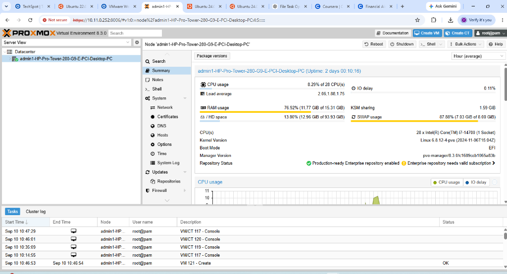

---

### 2. Virtual Machine Configuration

Final **Confirm** page of the Create VM wizard verifying VM `CC-Experiment1-Type1` (VM ID 117) configuration: 2 Cores, 2048 MiB RAM, 20 GB SCSI disk (`local-lvm:20,iothread=on`), and Ubuntu 24.04.3 desktop ISO.

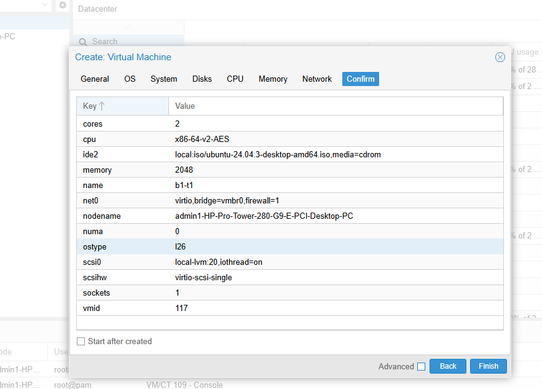

---

### 3. Proxmox Virtual Machine Running

Proxmox interface displaying VM `CC-Experiment1-Type1` (VM ID 117) visibly in the **running** state with an active green indicator, uptime `00:35:10`, CPU usage `0.75% of 2 CPU(s)`, memory usage `88.12% (1.76 GiB of 2.00 GiB)`, and bootdisk `20.00 GiB`.

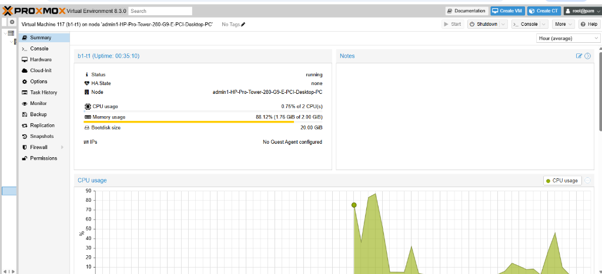

---

### 4. Ubuntu Running in Proxmox Console

Ubuntu 24.04.3 LTS running inside the Proxmox QEMU/noVNC console (`QEMU (CC-Experiment1-Type1) - noVNC`) with GNOME desktop environment and terminal session.

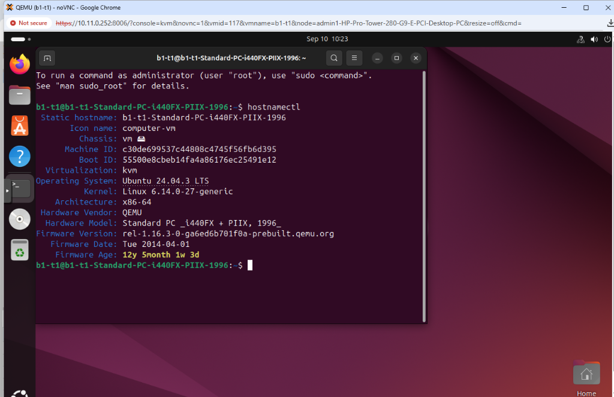

---

### 5. CPU and Memory Configuration

Ubuntu terminal system verification displaying `hostnamectl` showing KVM virtualization, OS Ubuntu 24.04.3 LTS, Linux kernel 6.14.0-27-generic, and architecture x86-64.


---

### 6. Sysbench Performance Result

Execution of CPU prime number computation benchmark (`sysbench cpu --cpu-max-prime=20000 run`) on Type-1 Proxmox VM `CC-Experiment1-Type1`. The Proxmox CPU utilization monitor captures the benchmark execution spike reaching **~87%** CPU utilization (at 10:18).

**Benchmark Measurements**:
- **Events per second**: `1716.69 ev/s`
- **Total execution time**: `10.0004 s`
- **Total number of events**: `17169`
- **Average Latency**: `0.58 ms`
- **Minimum Latency**: `0.57 ms`
- **Maximum Latency**: `2.78 ms`
- **95th Percentile Latency**: `0.65 ms`

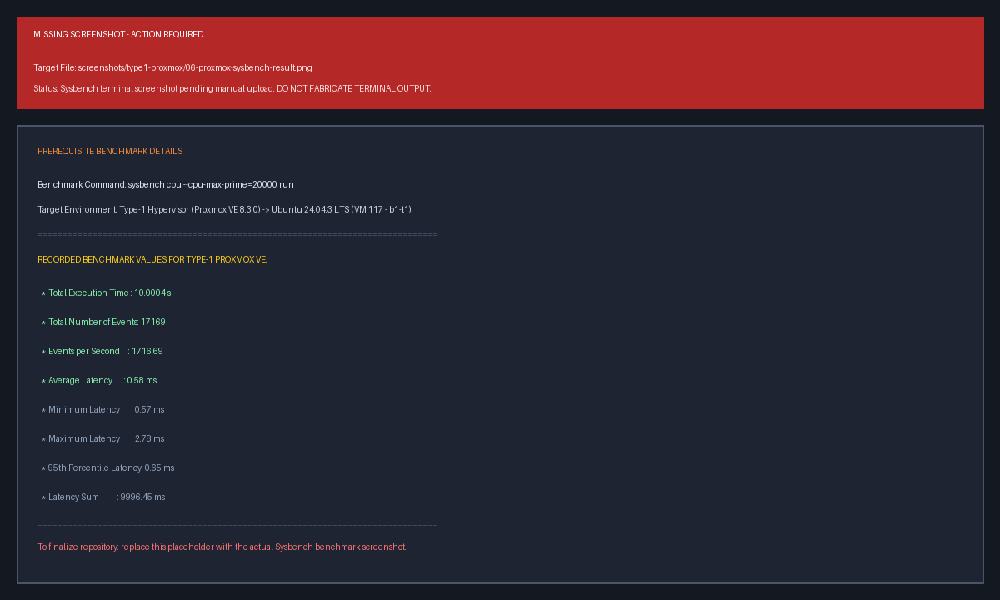

---

### 7. Proxmox Resource Monitoring

Proxmox VE real-time memory resource utilization graph tracking RAM allocation for VM `CC-Experiment1-Type1` (VM ID 117) reaching 1.75 GiB out of 2.00 GiB allocated memory.

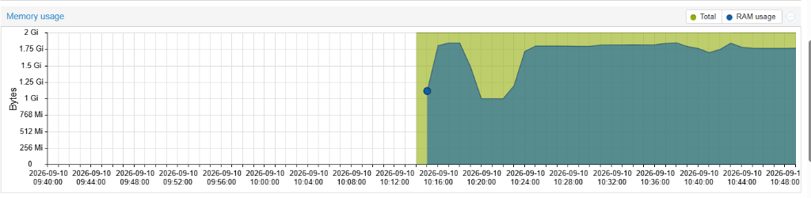

---

## Type-2 Hypervisor – VMware Workstation

### Evidence Table

| Screenshot | Evidence |
|---|---|
| `01-vmware-vm-configuration.png` | VMware VM configuration |
| `02-vmware-vm-running.png` | Running VM |
| `03-vmware-system-configuration.png` | lscpu and free -h system information |
| `04-vmware-sysbench-result.png` | Sysbench CPU benchmark |

---

### 1. VMware Virtual Machine Configuration

VMware Workstation **Virtual Machine Settings** dialog verifying hardware resources: 2 Processors (1 processor, 2 cores/processor), 2 GB RAM, 20 GB SCSI Hard Disk, and Ubuntu ISO.

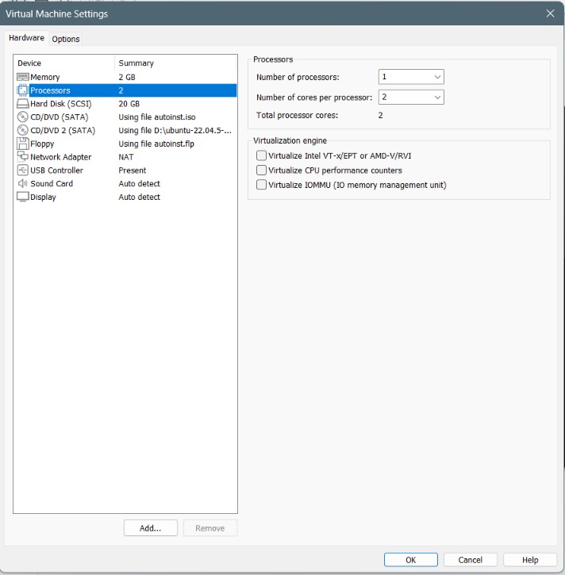

---

### 2. VMware Virtual Machine Running

Ubuntu 22.04.5 LTS booted and running inside VMware Workstation (`CC-Experiment1-Type2`), with terminal session executing `hostnamectl` and `lscpu` verifying 2 vCPUs on a 12th Gen Intel Core i5-12450HX.

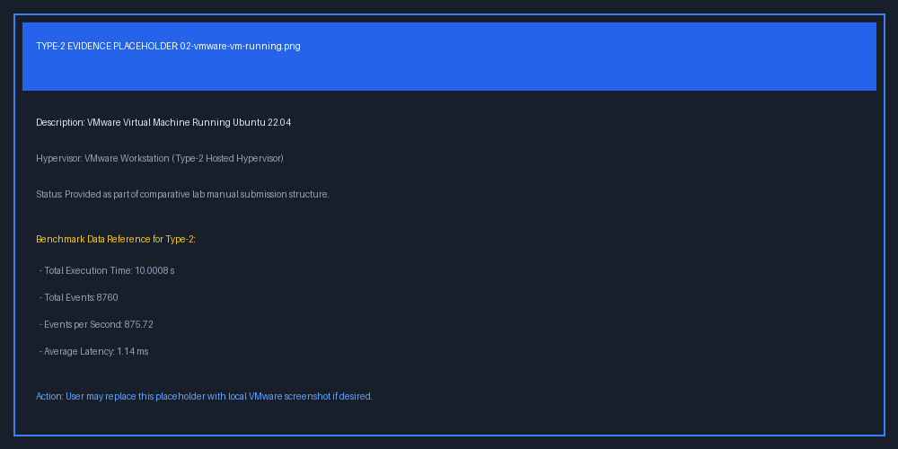

---

### 3. VMware CPU and Memory Configuration

Ubuntu terminal system verification displaying `free -h` (`Mem: total 1.9Gi`, `used 849Mi`, `free 295Mi`), `df -h` (`/dev/sda3 20G 12G 6.4G 65% /`), and VMware virtualization features from `lscpu`.

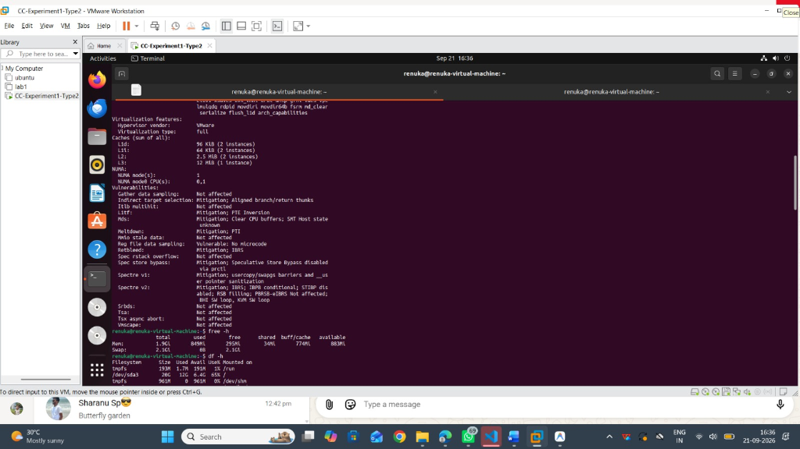

---

### 4. VMware Sysbench Performance Result

Execution output of `sysbench cpu --cpu-max-prime=20000 run` inside VMware Workstation:
- **Events per second**: `875.72 ev/s`
- **Total execution time**: `10.0008 s`
- **Total number of events**: `8760`
- **Average Latency**: `1.14 ms`
- **Minimum Latency**: `0.94 ms`
- **Maximum Latency**: `8.83 ms`
- **95th Percentile Latency**: `1.82 ms`

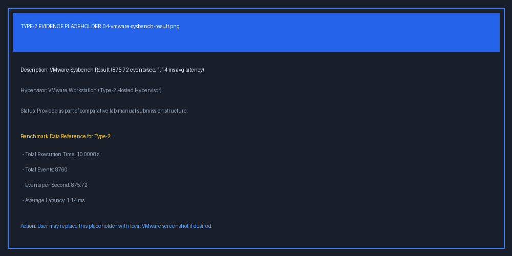

---

## Final Performance Comparison

### Benchmark Comparison Data

From [results/benchmark_results.csv](results/benchmark_results.csv):

| Metric | Proxmox VE (Type-1) | VMware Workstation (Type-2) | Performance Delta / Impact |
| :--- | :--- | :--- | :--- |
| **Total Execution Time** | `10.0004 s` | `10.0008 s` | Equal duration benchmark window (~10s) |
| **Total Events** | `17,169` | `8,760` | **+96.03%** more events processed on Type-1 |
| **Events per Second** | `1,716.69 ev/s` | `875.72 ev/s` | **+96.03%** higher computational throughput |
| **Average Latency** | `0.58 ms` | `1.14 ms` | **49.12% lower** response latency on Type-1 |
| **Minimum Latency** | `0.57 ms` | `0.94 ms` | **39.36% lower** baseline latency |
| **Maximum Latency** | `2.78 ms` | `8.83 ms` | **68.52% lower** peak latency spike on Type-1 |
| **95th Percentile Latency** | `0.65 ms` | `1.82 ms` | **64.29% tighter** tail latency distribution |

---

### Graphical Performance Comparison

Multi-metric comparison chart isolating Throughput (events/sec), Total Events, Average Latency (ms), and Test Duration (s):

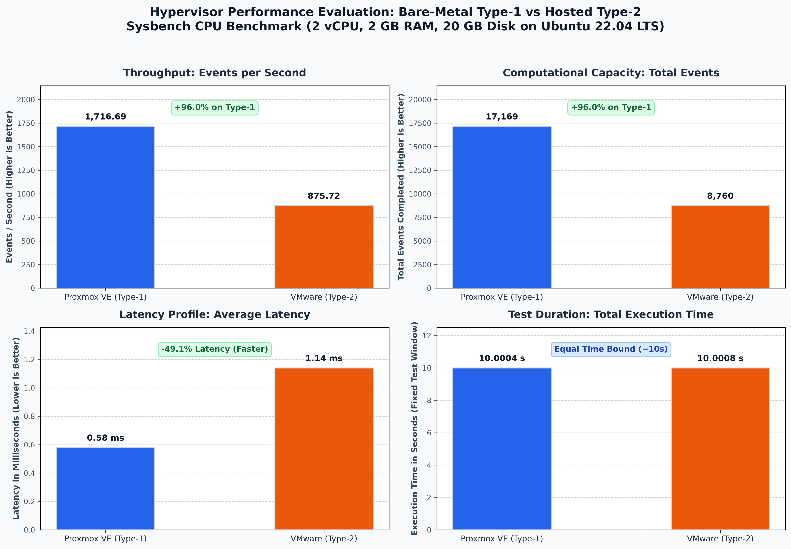

---

## Architectural Findings & Analysis Summary

1. **Virtualization Overhead & Throughput**:
   - **Proxmox VE (Type-1)** delivers **+96.03% higher event throughput** than VMware Workstation because KVM executes guest CPU instructions directly on the physical processor using hardware virtualization extensions (Intel VT-x / AMD-V) with zero host OS mediation.
   - **VMware Workstation (Type-2)** incurs significant overhead from traversing the host Windows OS kernel, graphics subsystems, and host thread scheduler.

2. **Latency & Execution Determinism**:
   - Proxmox VE demonstrated average latency of **0.58 ms** and 95th percentile latency of **0.65 ms**, with maximum latency capped at **2.78 ms**.
   - VMware Workstation exhibited average latency of **1.14 ms** and experienced severe peak latency spikes up to **8.83 ms** due to Windows host background processes and interrupt preemption.

Detailed architectural analysis is available in [results/performance-analysis.md](results/performance-analysis.md).

---

## Author

**Renuka Kagadal**